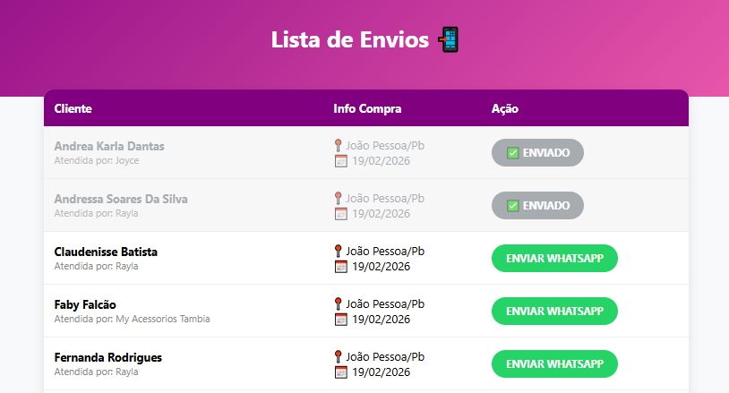

## 📸 Demonstração do Sistema (Pós-Venda)

<p align="center">
  
  
</p>


# 🌸 My Acessórios - Sistema de Pós-Venda

Sistema desenvolvido para automatizar e organizar o contato de pós-venda com clientes da loja **My Acessórios**. O sistema lê uma planilha de vendas, gera links personalizados de WhatsApp e organiza o fluxo de atendimento.

## 🚀 Funcionalidades
* **Leitura de Planilha:** Processa arquivos `.xlsx` capturando dados de clientes, vendedoras e compras.
* **Mensagens Personalizadas:** Gera automaticamente saudações usando apenas o primeiro nome da cliente e assinatura fixa da **Viviane**.
* **Gestão de Cliques:** Marcador visual que esmaece a linha da tabela após o clique, evitando envios duplicados.
* **Interface Limpa:** Abertura do WhatsApp sempre na mesma aba (`target="zap_janela"`) para evitar poluição no navegador.

## 🛠️ Tecnologias Utilizadas
* **Python 3.12**
* **FastAPI:** Framework web de alta performance.
* **Pandas & OpenPyXL:** Manipulação e leitura de dados de planilhas.
* **Jinja2:** Motor de templates para o frontend HTML/CSS.
* **Uvicorn:** Servidor ASGI para rodar a aplicação.

## 📋 Como rodar o projeto
1. Clone o repositório.
2. Crie um ambiente virtual: `python -m venv venv`.
3. Instale as dependências: 
   ```bash
   pip install fastapi uvicorn pandas openpyxl jinja2 python-multipart
